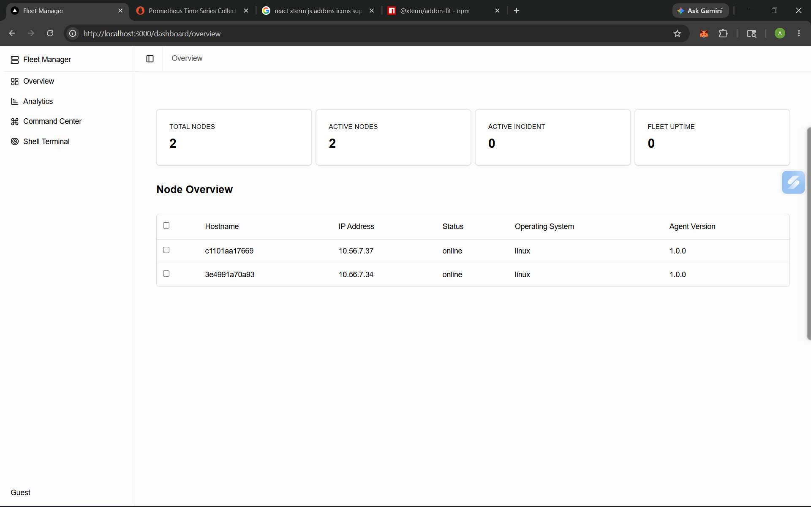
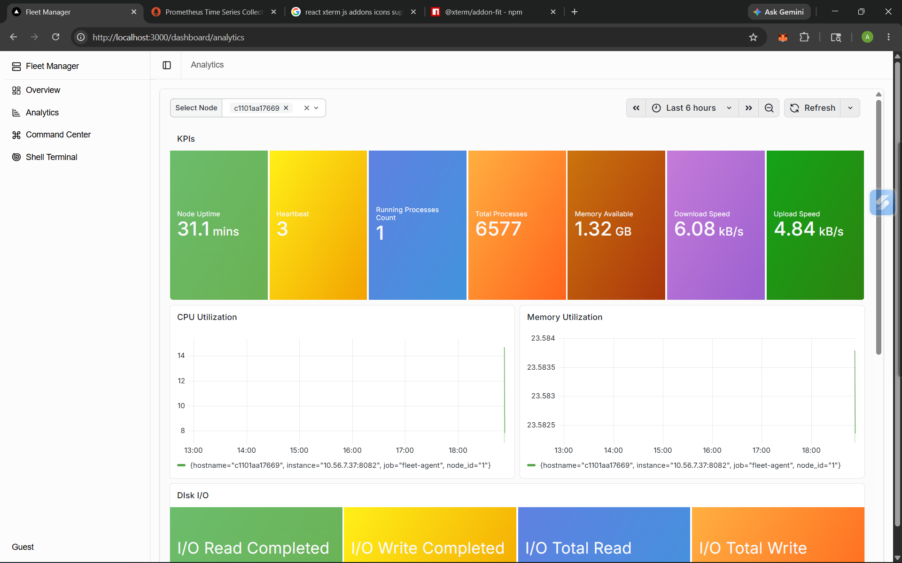
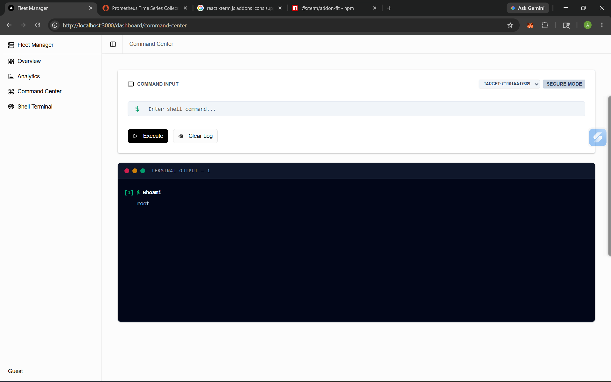
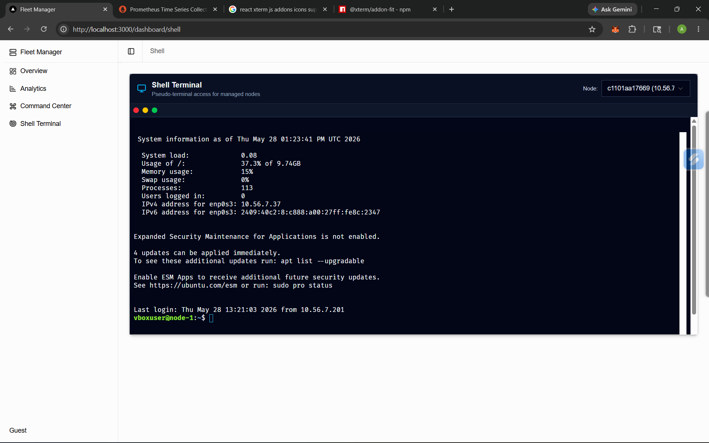

# Fleet Manager

A distributed system for managing and monitoring a fleet of devices.

## Project Structure

- `fleet-backend/`: C++ based central server managing state and APIs.
- `fleet-agent/`: C++ based agent to be installed on managed devices.
- `fleet-ui/`: Next.js frontend for monitoring and management.
- `docs/`: System architecture and design documentation.

## Getting Started

### Prerequisites

- Docker and Docker Compose
- C++20 Compiler (for local dev)
- CMake 3.25+
- vcpkg (for C++ dependency management)
- Node.js & Bun (for UI dev)

### Running with Docker

```bash
docker-compose up --build
```

On the Linux Node,

```bash
docker pull anuragborkar/fleet-agent:1.0.1
```

```bash
docker run --name agent -p 8081:8081 -p 8082:8082 -e FLEET_BACKEND_URL=http://<backend-ip>:8080 anuragborkar/fleet-agent:1.0.1
```

### Component URLs

- UI: `http://localhost:3000`
- Backend API: `http://localhost:8080/api/health`
- Prometheus - `http://localhost:9090`
- Grafana - `http://localhost:3001`

# Fleet Management UI

Open in browser: [http://localhost:3000](http://localhost:3000)

## Pages

- **Overview Page**  
  

- **Analytics Page**  
  

- **Command Center Page**  
  

- **SSH Shell Page**  
  
